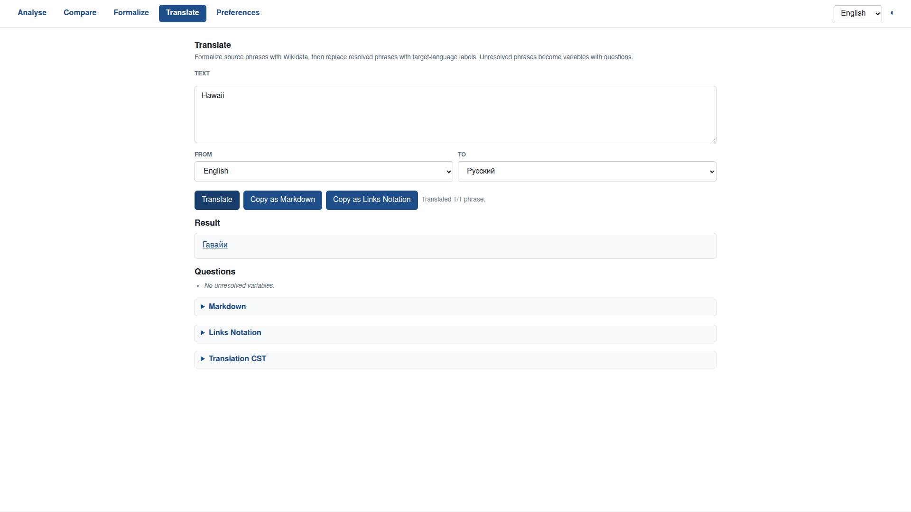

# Issue #16 Case Study: `/translate` and Formalization CST

Issue: <https://github.com/link-assistant/meta-expression/issues/16>

PR: <https://github.com/link-assistant/meta-expression/pull/28>

## Problem

The repository already had `/formalize`, but translation still needed a
traceable bridge from natural text to target-language labels. The issue asks
for a first automated translation slice based on Wikidata, plus a stronger
formalization output: Links Notation / CST must contain enough information to
regenerate Markdown and to act as the source for later transformation rules.

The issue also requires undefined parts to remain explicit as variables with
generated questions instead of being silently dropped or guessed.

## Captured Inputs

The data folder records the issue, PR state, recent related PRs, current
repository metadata, and code-search notes:

- [`data/issue-16.json`](./data/issue-16.json)
- [`data/issue-comments.json`](./data/issue-comments.json)
- [`data/pr-28.json`](./data/pr-28.json)
- [`data/recent-merged-prs.json`](./data/recent-merged-prs.json)
- [`data/human-language-repo.json`](./data/human-language-repo.json)
- [`data/link-cli-repo.json`](./data/link-cli-repo.json)
- [`data/start-repo.json`](./data/start-repo.json)
- [`data/link-foundation-substitution-code-search.txt`](./data/link-foundation-substitution-code-search.txt)

There were no issue comments when captured.

## Implemented Slice

- `formalizeTextWith()` now returns a `cst` with phrase ids, token spans,
  candidate summaries, resolved entity ids, generated target URLs, and contexts.
- `markdownFromFormalizationCst(cst)` regenerates the same formalized Markdown
  without rerunning lookup or disambiguation.
- `translateTextWith()` runs formalization first, fetches target-language
  Wikidata labels for Q/P ids, emits Markdown/HTML/Links Notation/CST, and
  preserves unresolved terms as variables with questions.
- `translate` is exposed through the library, CLI, HTTP service, and the static
  web app at `#/translate`.
- `tests/issue-16.test.js` covers the CST/Markdown contract, translation,
  variables/questions, CLI flags, CLI output, POST `/translate`, and static web
  wiring.

## Browser Verification

The static web page was served locally and exercised with Playwright at
`http://127.0.0.1:4173/web/#/translate`. The default `Hawaii` input translated
to the Russian Wikidata label and linked to Russian Wikipedia.

## Boundary

This PR intentionally implements rough term-level translation. It does not yet
perform grammar-aware reordering, sentence-level transformation rules, or
full Links Notation CST rewriting. Those are now documented as the next layer
once the repo adopts parser-backed Links Notation manipulation.
