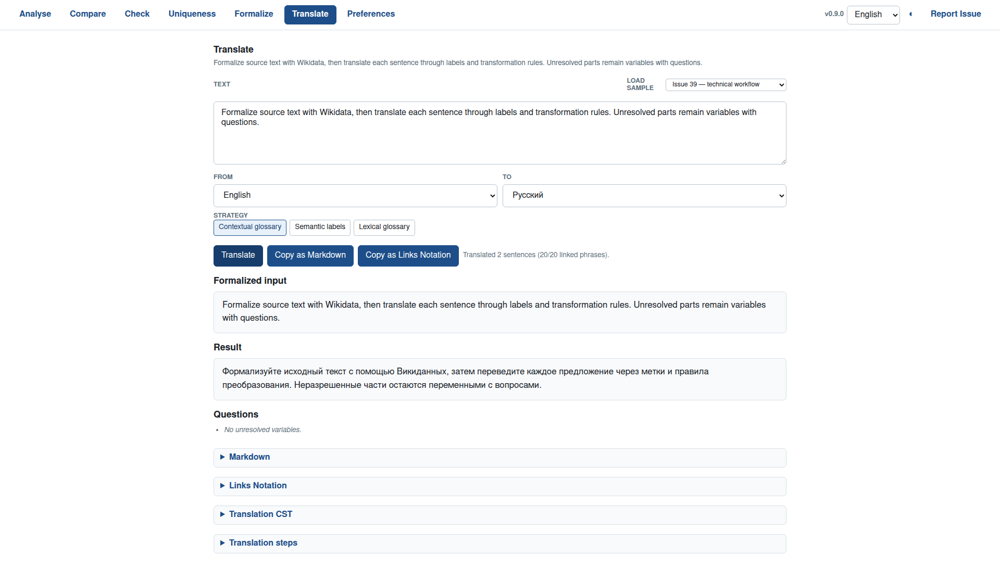
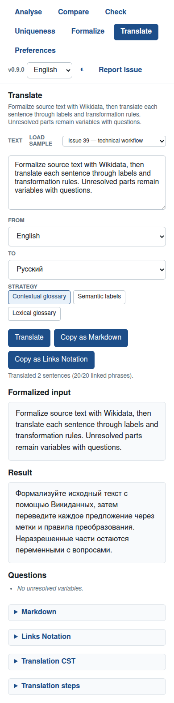

# Issue #39 Case Study: Translate Technical Workflow Text

Issue: <https://github.com/link-assistant/meta-expression/issues/39>

PR: <https://github.com/link-assistant/meta-expression/pull/40>

## Problem

The Translate page did not produce a useful Russian translation for:

```text
Formalize source text with Wikidata, then translate each sentence through labels and transformation rules. Unresolved parts remain variables with questions.
```

The initial report showed noisy multi-token links, unresolved variables, and
English output. A live local capture before this fix still preserved the source
language when target lookups were rate-limited:

```text
Formalize source text with Wikidata then translate each sentence through labels and transformation rules. Unresolved parts remain variables with questions.
```

## Captured Inputs

The `data` folder preserves the issue, PR context, live reproductions, and test
logs used for this fix:

- [`data/issue-39.json`](./data/issue-39.json)
- [`data/issue-39-comments.json`](./data/issue-39-comments.json)
- [`data/pr-40.json`](./data/pr-40.json)
- [`data/pr-40-comments.json`](./data/pr-40-comments.json)
- [`data/pr-40-review-comments.json`](./data/pr-40-review-comments.json)
- [`data/pr-40-reviews.json`](./data/pr-40-reviews.json)
- [`data/search-translateTextWith.json`](./data/search-translateTextWith.json)
- [`data/recent-merged-translation-prs.json`](./data/recent-merged-translation-prs.json)
- [`data/live-formalize-before.json`](./data/live-formalize-before.json)
- [`data/live-translate-before.json`](./data/live-translate-before.json)
- [`data/live-formalize-after.json`](./data/live-formalize-after.json)
- [`data/live-translate-after.json`](./data/live-translate-after.json)
- [`data/node-issue-39-before.log`](./data/node-issue-39-before.log)
- [`data/node-issue-39-after.log`](./data/node-issue-39-after.log)
- [`data/node-related-translation-after.log`](./data/node-related-translation-after.log)
- [`data/npm-test.log`](./data/npm-test.log)
- [`data/npm-check.log`](./data/npm-check.log)
- [`data/bun-test.log`](./data/bun-test.log)
- [`data/deno-test.log`](./data/deno-test.log)
- [`data/check-file-line-limits.log`](./data/check-file-line-limits.log)
- [`data/npm-install.log`](./data/npm-install.log)
- [`translate-ui.png`](./translate-ui.png)
- [`translate-ui-mobile.png`](./translate-ui-mobile.png)

## Timeline

1. Issue #39 was opened from the Translate page on May 22, 2026 with the
   reported text, options `en -> ru`, and unresolved output.
2. The prepared PR #40 contained only the bootstrap commit and no review
   comments.
3. Local live reproduction before the fix captured target lookup failures with
   Wikimedia HTTP 429 responses and source-language output.
4. A focused failing test was added in
   [`tests/issue-39.test.js`](../../../tests/issue-39.test.js) to require the
   reported text to translate to readable Russian.
5. The translator gained explicit strategy selection, a contextual glossary,
   structured question options, and Translate-page controls.
6. Browser smoke testing found one more live-path failure: a cached or live
   candidate could claim `transformation rules Unresolved` across a period.
   Sentence-boundary-aware n-gram generation now rejects that class of phrase.
7. The live after-capture now emits:

```text
Формализуйте исходный текст с помощью Викиданных, затем переведите каждое предложение через метки и правила преобразования. Неразрешенные части остаются переменными с вопросами.
```

## Root Causes

- The old translation path was effectively "semantic labels only". That works
  for entity names such as `Hawaii`, but common technical verbs and grammar
  words often need lexical and grammatical handling instead of a Wikidata item
  label.
- Longest n-gram coverage could accept phrases that ended with glue words, such
  as `text with` or `Wikidata then`, which prevented later sentence rules from
  seeing the useful phrase boundaries.
- Token n-grams were generated after punctuation was removed, so live or cached
  candidates could span across sentence boundaries such as
  `transformation rules. Unresolved`.
- The UI did not expose supported Translate examples, strategy selection, or
  structured answer options for unresolved variables.
- Live target lookup performs additional Wikimedia requests after formalization.
  When those requests hit 429 rate limits, the old path had no deterministic
  local fallback.

## Implemented Slice

- Added `TRANSLATION_STRATEGIES` and `listTranslationStrategies()` with:
  `contextual-glossary`, `semantic-label`, and `lexical-glossary`.
- Made `contextual-glossary` the default Translate strategy. It uses curated
  phrase translations first, including multi-word glossary decomposition, then
  leaves the existing semantic-label path available as a strict fallback.
- Added English-to-Russian sentence rules for `with Wikidata`, preserving the
  comma before `then`, and the `transformation rules -> правила преобразования`
  noun phrase.
- Tightened formalization n-gram boundaries so multi-token candidates cannot
  start or end with English grammar glue and cannot cross sentence punctuation.
  Exact lowercase Wiktionary matches now receive a small score boost over
  unrelated proper-name entities.
- Added `questionDetails` with selectable answer options while preserving the
  legacy `questions: string[]` field.
- Added Translate-page sample loading and a strategy toggle group.

## UI Verification

The screenshots below were captured from the static web app with a deterministic
empty Wikimedia response stub, so the visual evidence checks UI wiring and
local fallback behavior without depending on live API rate limits.





## Boundary

This PR does not make the project a general-purpose machine translation engine.
It adds a deterministic, test-covered slice for short technical English to
Russian workflow text, keeps the traceable semantic-label strategy, and records
the remaining larger solution in [`SOLUTION-PLAN.md`](./SOLUTION-PLAN.md).
