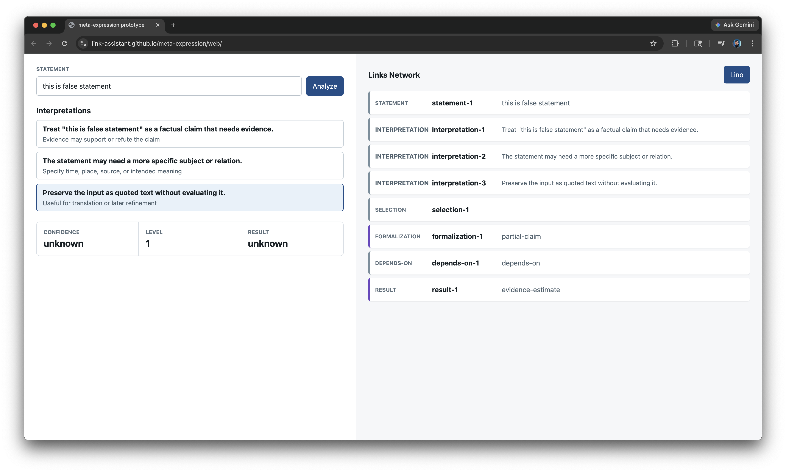
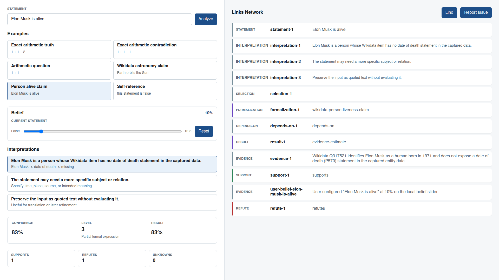
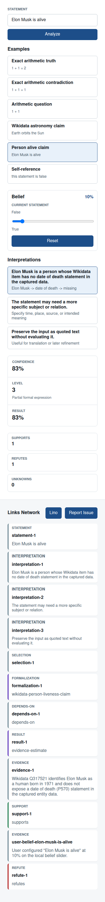

# Case Study: Issue #5 - Continue Working on Our Vision

**Issue:** [link-assistant/meta-expression#5](https://github.com/link-assistant/meta-expression/issues/5)
**Title:** Continue working on our vision
**Status:** Product slice and case-study analysis implemented
**Created:** 2026-04-26
**Analysis date:** 2026-04-26

## Executive Summary

Issue #5 asks the prototype to become more real against the original
meta-expression vision. The key problem shown in the issue screenshot is that
many non-arithmetic statements collapse into an unhelpful `unknown` state, while
the UI exposes only a numeric formalization level and does not yet show the
requested prepared examples, local belief configuration, or issue-reporting
flow.

This PR keeps the implementation deliberately small but moves the product
forward in the places the issue made concrete:

- `1 + 1` is now treated as an arithmetic question expression.
- `Elon Musk is alive` has bounded Wikidata-backed fixture evidence rather than
  plain unknown.
- Real-world evidence confidence is bounded away from `0%` and `100%`.
- Self-referential false statements are marked as `undetermined` with `50%`
  confidence rather than as missing evidence.
- Local user beliefs can become support/refute evidence and are exposed in the
  web prototype as a persistent slider saved in `localStorage`.
- Formalization levels have names and summaries.
- Prepared examples and one-click GitHub issue reporting are available from the
  static web page.

The larger requirements, including live Wikidata/Wikipedia traversal in a
worker thread, Doublets-backed binary storage, Rust/WASM, Unicode strings as
links, and custom formal systems, are tracked as follow-up roadmap items rather
than hidden inside this small deterministic prototype.

## Data Collected

Raw data and reference captures are stored under [`data/`](./data/):

| File                                                                        | Purpose                                                                |
| --------------------------------------------------------------------------- | ---------------------------------------------------------------------- |
| [`issue-5.json`](./data/issue-5.json)                                       | Full issue title, body, labels, author, and timestamps                 |
| [`issue-5-comments.json`](./data/issue-5-comments.json)                     | Issue comments; empty at analysis time                                 |
| [`pr-6.json`](./data/pr-6.json)                                             | Prepared PR metadata before implementation                             |
| [`pr-6-conversation-comments.json`](./data/pr-6-conversation-comments.json) | PR discussion comments; empty at analysis time                         |
| [`pr-6-review-comments.json`](./data/pr-6-review-comments.json)             | PR inline comments; empty at analysis time                             |
| [`pr-6-reviews.json`](./data/pr-6-reviews.json)                             | PR reviews; empty at analysis time                                     |
| [`meta-expression-file-tree.txt`](./data/meta-expression-file-tree.txt)     | Local repository file inventory                                        |
| [`wikidata-q317521.json`](./data/wikidata-q317521.json)                     | Captured Wikidata entity data for Elon Musk                            |
| [`wikidata-q2.json`](./data/wikidata-q2.json)                               | Captured Wikidata entity data for Earth                                |
| [`calculator-reportIssue.ts`](./data/calculator-reportIssue.ts)             | Reference issue-report implementation from `link-assistant/calculator` |
| [`human-language-readme.md`](./data/human-language-readme.md)               | Reference Wikidata/Q-P project context                                 |
| [`link-cli-readme.md`](./data/link-cli-readme.md)                           | Reference Links Notation and link-store CLI context                    |

The issue screenshot was downloaded and verified as a PNG:



Rendered prototype screenshots after this PR:





## Source Findings

Online research and ecosystem source review are summarized in
[`ONLINE-RESEARCH.md`](./ONLINE-RESEARCH.md). The most relevant findings:

- Wikidata exposes structured entity, property, and statement data through the
  REST/API surface, while WDQS/SPARQL is best reserved for scoped queries after
  candidate Q/P identifiers are known.
- Web Workers are the browser mechanism for moving expensive retrieval or
  traversal work off the main UI thread.
- `localStorage` persists per-origin data across browser sessions and is enough
  for the current belief-slider prototype.
- `link-assistant/calculator` already has a proven pattern for creating
  prefilled GitHub issue URLs from current page state.
- `link-assistant/human-language` provides the closest in-ecosystem reference
  for Wikidata entity/property mapping and browser-side semantic exploration.

## Implemented Product Slice

| Area                   | Implementation                                                                                            |
| ---------------------- | --------------------------------------------------------------------------------------------------------- |
| Arithmetic question    | `1 + 1` is formalized as `arithmetic-question` and evaluates to `2`.                                      |
| Real-world uncertainty | Evidence-backed real-world claims are clamped to `1%..99%` by default.                                    |
| Person alive claim     | `Elon Musk is alive` uses Wikidata Q317521/P570 fixture evidence captured on 2026-04-26.                  |
| Self-reference         | `this statement is false` is marked as `self-reference-paradox`, value `undetermined`, confidence `0.5`.  |
| User beliefs           | `analyzeStatement` accepts `userBeliefs`; non-50% values become local support/refute evidence.            |
| Formalization levels   | `describeFormalizationLevel` exposes stable names, summaries, and executability flags.                    |
| Prepared examples      | `getPreparedExamples` drives the web example buttons.                                                     |
| Issue reporting        | `createIssueReportUrl` generates a GitHub issue URL with statement, result, evidence, and Links Notation. |
| Web prototype          | Adds examples, belief slider, evidence counts, readable level label, and report button.                   |

## Requirement Coverage

The full extracted matrix is in [`REQUIREMENTS.md`](./REQUIREMENTS.md). This PR
directly covers the issue's concrete examples and UX gaps. It intentionally
does not claim to implement live Wikipedia/Wikidata traversal or Doublets
persistence yet; those are kept in [`ROADMAP.md`](./ROADMAP.md) with specific
acceptance criteria.

## Validation

Automated coverage was added to `tests/prototype.test.js` for:

- arithmetic question evaluation,
- bounded real-world evidence confidence,
- Wikidata-backed person alive evidence,
- local user belief support/refute evidence,
- self-referential false statement handling,
- prepared examples, formalization-level descriptions, and issue report URLs.

The local check used during implementation:

```bash
npm test
```

## Conclusion

The issue is larger than a single PR, but the repository now has a more honest
product baseline: real-world statements are not presented with absolute
certainty, user belief overrides are represented as explicit evidence, the
formalization level is inspectable, and the web page contains the prepared
examples and reporting path needed for continued iteration.
